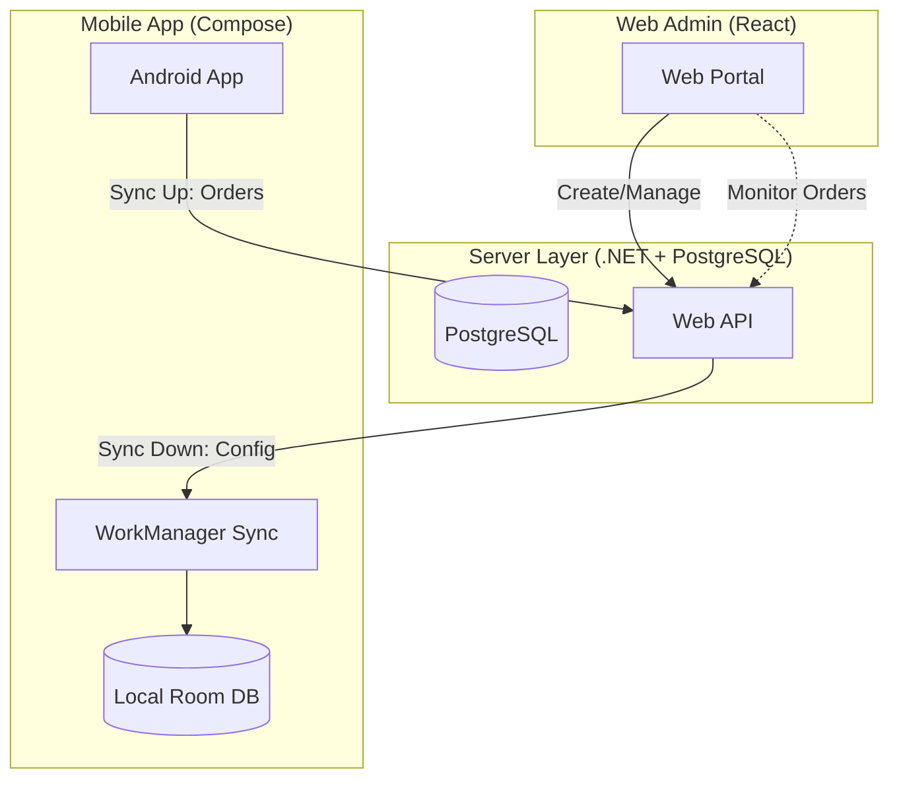

# Fold&Go: Senior Technical Blueprint & UI/UX Specification
## Multi-Platform Laundry Management Ecosystem (Mobile + Web Admin)

---

### 1. System Architecture & Scope

**Fold&Go** is a dual-surface ecosystem designed for real-time laundry operations. It follows a **Configuration-Centralized** model where the Web Admin manages the business infrastructure and the Mobile App executes the daily operations.

#### Project Scope
*   **Web Admin (Owner-Centric):** The "Control Center". Handles creation and configuration of Shops, Staff, Machines, Services, and Inventory.
*   **Mobile App (Operator-Centric):** The "Operation Center". Synchronizes configuration data down from the server based on the logged-in Shop. Focuses exclusively on Order Intake, Processing, and Fulfillment.
*   **Backend (.NET Core + PostgreSQL):** The "Source of Truth". Provides REST APIs for the Web Admin (Full CRUD) and the Mobile App (Sync-Down for Config, Sync-Up for Transactions).

#### Technology Stack
*   **Mobile:** Kotlin 2.4.0, Jetpack Compose, Room 2.8.4, Koin 4.2.2.
*   **Web:** React (Vite), TypeScript, Tailwind CSS.
*   **Backend:** .NET Core 9.0 (EF Core), PostgreSQL, SignalR (Real-time monitoring).

---

### 2. Synchronization Architecture



---

### 3. Current Data Schema (Source: Entities.kt)

These entities are shared between the PostgreSQL schema and the Mobile Room database.

#### A. Configuration Entities (Sync Down to Mobile)
*Mobile app no longer handles creation for these.*

```kotlin
@Entity(tableName = "shops")
data class ShopEntity(
    @PrimaryKey val shopId: String,
    val name: String,
    val address: String,
    val ownerId: String,
    val pin: String,
    val settings: String, // JSON configuration
    val createdAt: Long
)

@Entity(tableName = "staff")
data class StaffEntity(
    @PrimaryKey val staffId: String,
    val shopId: String,
    val name: String,
    val role: String,
    val isActive: Boolean,
    val createdAt: Long
)

@Entity(tableName = "machine_categories")
data class MachineCategoryEntity(
    @PrimaryKey val categoryId: String,
    val name: String,
    val type: MachineType,
    val iconName: String?,
    val colorHex: String?
)

@Entity(tableName = "machines")
data class MachineEntity(
    @PrimaryKey val machineId: String,
    val shopId: String,
    val name: String,
    val type: MachineType,
    val capacityKg: Double,
    val status: MachineStatus,
    val lastMaintenanceDate: Long,
    val endTime: Long?,
    val cyclesCount: Int
)

@Entity(tableName = "services")
data class ServiceEntity(
    @PrimaryKey val serviceId: String,
    val shopId: String,
    val name: String,
    val defaultQuantity: Double,
    val unit: String,
    val pricePerUnit: Double,
    val type: ServiceType
)

@Entity(tableName = "inventory")
data class InventoryEntity(
    @PrimaryKey val itemId: String,
    val shopId: String,
    val name: String,
    val currentStock: Double,
    val unit: String,
    val lowStockThreshold: Double
)
```

#### B. Transactional Entities (Sync Up to Server)
```kotlin
@Entity(tableName = "orders")
data class OrderEntity(
    @PrimaryKey val orderId: String,
    val shopId: String,
    val customerId: String,
    val customerName: String,
    val customerPhone: String,
    val orderNumber: String,
    val itemsJson: String,
    val totalAmount: Double,
    val paidAmount: Double,
    val changeDue: Double,
    val status: OrderStatus,
    val deliveryMethod: DeliveryMethod,
    val paymentStatus: PaymentStatus,
    val machineId: String?,
    val staffId: String,
    val staffName: String,
    val createdAt: Long,
    val updatedAt: Long,
    val isSynced: Boolean = false
)
```

---

### 4. API Endpoints Specification (.NET Core API)

#### A. Auth & Shop Setup (Shared)
*   `POST /api/auth/login` - User authentication (Web Admin).
*   `POST /api/auth/shop-login` - PIN-based authentication for Mobile (returns `shopId` + JWT).

#### B. Configuration API (Web: CRUD | Mobile: GET)
*   `GET/POST/PUT/DELETE /api/shops` - Management of shop branches.
*   `GET/POST/PUT/DELETE /api/staff?shopId={id}` - Management of operators and PIN codes.
*   `GET/POST/PUT/DELETE /api/machines?shopId={id}` - Registration and configuration of hardware.
*   `GET/POST/PUT/DELETE /api/services?shopId={id}` - Service menu and pricing definition.
*   `GET/POST/PUT/DELETE /api/inventory?shopId={id}` - Stock level management and thresholds.

#### C. Synchronization API (Mobile Sync-Down)
*   `GET /api/sync/config?shopId={id}` - Single bundle fetch of all `Staff`, `Machines`, `Services`, and `Inventory` for the local database refresh.

#### D. Transactional API (Mobile Sync-Up | Web: View)
*   `POST /api/orders` - Submit new orders (Sync up from Mobile).
*   `PATCH /api/orders/{id}/status` - Update order progress (Sync up from Mobile).
*   `GET /api/orders?shopId={id}` - Fetch historical or live orders (Web Admin / Mobile).
*   `GET /api/reports/sales?shopId={id}&range={from-to}` - Revenue data for Web Admin analytics.

---

### 5. Operational Flows

#### A. Setup & Sync Flow (New Strategy)
1.  **Web Admin:** Owner logs in, creates a `Shop`, adds `Staff`, registers `Machines`, and defines `Services` + `Pricing`.
2.  **Mobile Login:** Operator enters Shop Credentials/PIN.
3.  **Initial Sync:** Mobile app calls `GET /api/sync/config` to fetch all setup data.
4.  **Local Storage:** Room DB is populated. Mobile app is now ready for offline-first order intake.

#### B. Order Lifecycle (Mobile)
1.  **Intake:** Select from synced `Services`. Save locally.
2.  **Execution:** Assign to synced `Machines`.
3.  **Sync Up:** `SyncOutboxEntity` triggers `POST /api/orders` to push data to the cloud.

---

### 6. Web Admin Features (React + .NET)

*   **Creation Wizard:** Interactive flow to set up a new shop from scratch.
*   **Live Dashboard:** Real-time `OrderStatus` updates via SignalR connection to the API.
*   **Machine Health:** Monitor `cyclesCount` and maintenance needs synced from the shop floor.

---

### 7. Senior Design System: "Clean & Fresh"

*   **Primary:** `Deep Ocean Blue (#005CBB)` - Reliability.
*   **Mobile:** Focus on tactile speed. Minimal typing, maximum selection.
*   **Web:** Focus on data density, filtering, and exportable reports.
